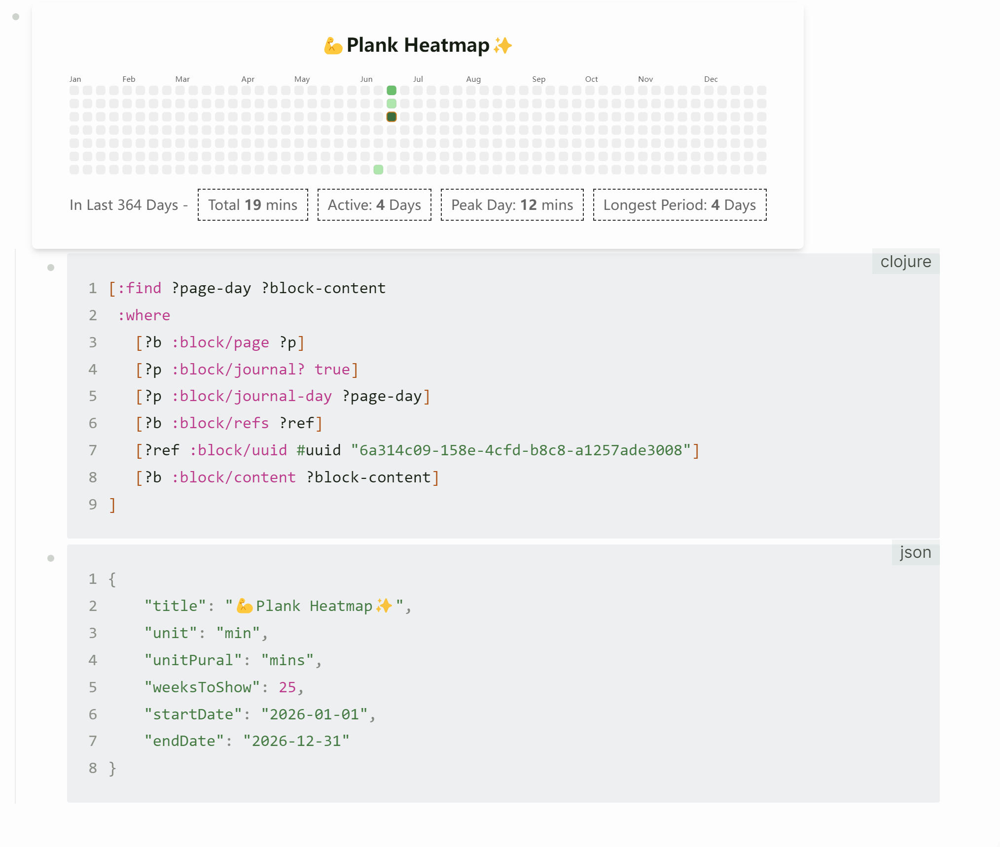
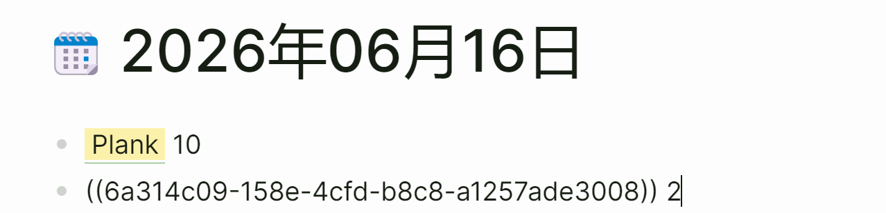

# Logseq Heatmap Block Plugin

This plugin renders a heatmap based on a provided data query and offers minor styling configurations. You can use it to track habits.

## How to Use

Type `/Heatmap` to automatically generate a data query that tracks the content of a specific block reference across each daily log, along with a JSON code block where you can write your chart parameters.

For the query results, the plugin will attempt to parse whether they contain numbers. If parsing fails, it will default to a count of `1`, and then aggregate the total for that day.

| Parameter | Type | Description |
| -------- | -------- | -------- |
| formattedData | Array<{ date: string, count: number }> | Retrieved via the data query; date format is "YYYY-MM-DD" |
| weeksToShows | number? | The time period to display (in weeks) |
| title | string? | Chart title |
| titleAlign | "left" \| "right" \| "center" | Chart title alignment |
| unit | string? | Unit for the number of activities |
| unitPural | string? | Plural unit for the number of activities |
| colorPalette | string[]? | Custom colors; features levels 0–4 by default. Custom colors only support 6-digit hex codes |
| defaultFill | string? | Default background color for elements |
| showTotalTimes | boolean? | Display total number of times |
| showActiveDays | boolean? | Display total number of active days |
| showPeakDays | boolean? | Display maximum count in a single day |
| showLongestStreak | boolean? | Display the longest continuous active streak |

## Demo

